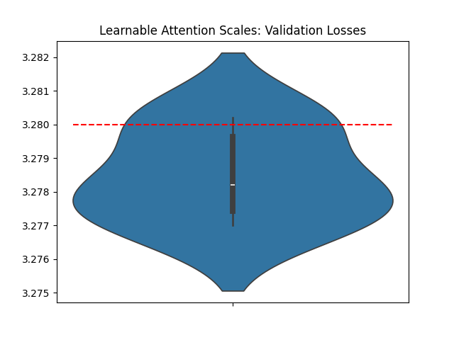
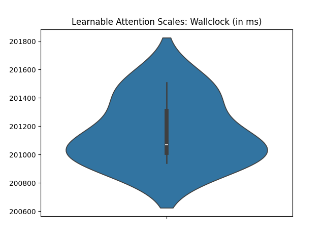

# Learnable Attention Scale

This record, by [Franz Cesista](@leloykun), makes the attention scale learnable instead of just being fixed at $1/\sqrt{d}$.

Originally recommended by the [OG paper on QK-Normalization](https://arxiv.org/abs/2010.04245) and more recently by the [Cosmos team at NVidia](https://arxiv.org/abs/2501.03575v1).




---

The Jan 4 2025 record takes 205.5 secs on my 8xH100 machine (vs. the 204.4 secs as reported), but this new record takes 203.7 secs on my machine--at most a 2 sec improvement.

```python
acc = [3.277, 3.2801, 3.2772, 3.2783, 3.2802, 3.2781]

import scipy.stats
print('p=%.4f' % scipy.stats.ttest_1samp(accs, 3.28, alternative='less').pvalue)
# p=0.0218
```

---

Wallclock time improvement: ~1.7 secs on Franz' machine

Record | Wallclock time (ms)
--- | ---
Jan 4, 2025 record runtime on Franz' machine | 202898 ms
This record on Franz' machine | 201162 ms
