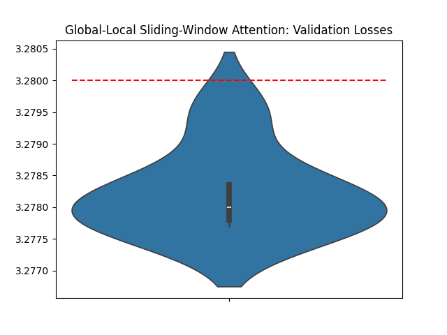
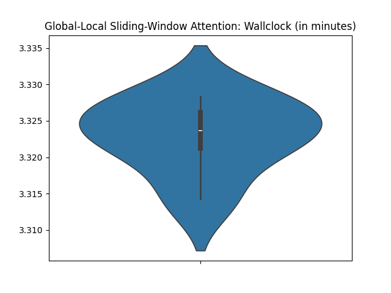

# Long-Short Sliding Window Attention

Currently, we warmup the context length of the sliding window attention at the same rate in all layers. This attempt warms up the context length in every other layer at _half_ the rate instead. This leads to a ~3 ms/step improvement. However, to compensate for the increase in `val_loss`, we needed to add 15 more training steps. Overall, this saves ~2 secs on our 8xH100 pod.

- c @YouJiacheng for optimizing and simplifying the code for the sliding window block attention. His efforts made implementing this change much easier.




```diff
- def create_doc_swc_block_mask(sliding_window_num_blocks):
+ def create_doc_swc_block_masks(sliding_window_num_blocks: int):
    kv_idx = block_idx = torch.arange(total_num_blocks, dtype=torch.int32, device='cuda')
    q_idx = block_idx[:, None]
    causal_bm = q_idx >= kv_idx
    causal_full_bm = q_idx > kv_idx
    window_bm = q_idx - kv_idx < sliding_window_num_blocks
    window_full_bm = window_bm # block-wise sliding window by @YouJiacheng
    # document_bm = (docs_low[q_idx] <= docs_high[kv_idx]) & (docs_low[kv_idx] <= docs_high[q_idx])
    document_bm = (docs_low[:, None] <= docs_high) & (docs_low <= docs_high[:, None])
    document_full_bm = (docs_low[:, None] == docs_high) & (docs_low == docs_high[:, None])
    nonzero_bm = causal_bm & window_bm & document_bm
    full_bm  = causal_full_bm & window_full_bm & document_full_bm
    kv_num_blocks, kv_indices = dense_to_ordered(nonzero_bm & ~full_bm)
    full_kv_num_blocks, full_kv_indices = dense_to_ordered(full_bm)
-     return BlockMask.from_kv_blocks(
-         kv_num_blocks,
-         kv_indices,
-         full_kv_num_blocks,
-         full_kv_indices,
-         BLOCK_SIZE=BLOCK_SIZE,
-         mask_mod=document_causal,
-     )
+     global_block_mask = BlockMask.from_kv_blocks(
+         kv_num_blocks,
+         kv_indices,
+         full_kv_num_blocks,
+         full_kv_indices,
+         BLOCK_SIZE=BLOCK_SIZE,
+         mask_mod=document_causal,
+     )
+     local_window_bm = q_idx - kv_idx < max(1, sliding_window_num_blocks // 2)
+     local_window_full_bm = local_window_bm
+     local_nonzero_bm = causal_bm & local_window_bm & document_bm
+     local_full_bm = causal_full_bm & local_window_full_bm & document_full_bm
+     local_kv_num_blocks, local_kv_indices = dense_to_ordered(local_nonzero_bm & ~local_full_bm)
+     local_full_kv_num_blocks, local_full_kv_indices = dense_to_ordered(local_full_bm)
+     local_block_mask = BlockMask.from_kv_blocks(
+         local_kv_num_blocks,
+         local_kv_indices,
+         local_full_kv_num_blocks,
+         local_full_kv_indices,
+         BLOCK_SIZE=BLOCK_SIZE,
+         mask_mod=document_causal,
+     )
+     return global_block_mask, local_block_mask
...
- block_mask = create_doc_swc_block_mask(sliding_window_num_blocks)
+ global_block_mask, local_block_mask = create_doc_swc_block_masks(sliding_window_num_blocks)
...
skip_connections = []
# Encoder pass - process only the first half of the blocks
for i in range(self.num_encoder_layers):
+     block_mask = global_block_mask if i % 2 == 0 else local_block_mask
    x = self.blocks[i](x, ve_enc[i], x0, block_mask)
    skip_connections.append(x)
# Decoder pass - process the remaining blocks with weighted skip connections
for i in range(self.num_decoder_layers):
+     block_mask = local_block_mask if i % 2 == 0 else global_block_mask
    x = x + self.skip_weights[i] * skip_connections.pop()
    x = self.blocks[self.num_encoder_layers + i](x, ve_dec[i], x0, block_mask)
```

```python
val_losses = [3.2786, 3.2781, 3.2776, 3.2765, 3.2783, 3.2782]

import scipy.stats
print('p=%.4f' % scipy.stats.ttest_1samp(val_losses, 3.28, alternative='less').pvalue)
# p=0.0005
```

---

This is similar to the Local-Global Attention in [Gemma 2](https://arxiv.org/pdf/2408.00118), except we use Sliding Window Attention for all layers and instead just warmup the context length at different rates during training.
