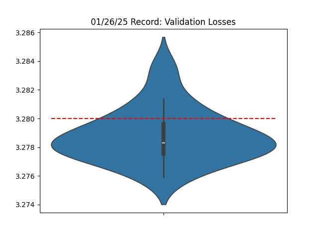

# 11/26/25 - Misc Tweaks

Changelogs:

1. Calculate backward passes of linear layers in `bfloat16`, but keep the weights in `float32`
2. Reduced training per-device sequence length from `64*1024` to `48*1024` (see Critical Batch Size literature)
3. Increased eval per-device sequence length from `64*1024` to `4*64*1024`
4. Upgrade PyTorch to 2.7.0 nightly version (20250125) for CUDA 12.6
  - `pip install --pre torch==2.7.0.dev20250125+cu126 --index-url https://download.pytorch.org/whl/nightly/cu126`
5. Cleanups and minor refactors

Changes 3-5 might not actually impove performance, but changes 1-2 helps reduce wallclock time by 2.4 secs per iteration.




```python
accs = [3.2806, 3.2829, 3.2813, 3.2789, 3.2798, 3.2794, 3.2775, 3.2768, 3.2793, 3.2838, 3.2779, 3.2782, 3.2775, 3.2784, 3.2776, 3.2814, 3.2785, 3.2793, 3.2797, 3.2782, 3.2759, 3.2803, 3.278, 3.2782]

import scipy.stats
print('p=0.00' % scipy.stats.ttest_1samp(accs, 3.28, alternative='less').pvalue)
# p=0.0171 (statistically significant)

import torch
print(torch.std_mean(torch.tensor(accs)))
# (tensor(0.0019), tensor(3.2791))
```
