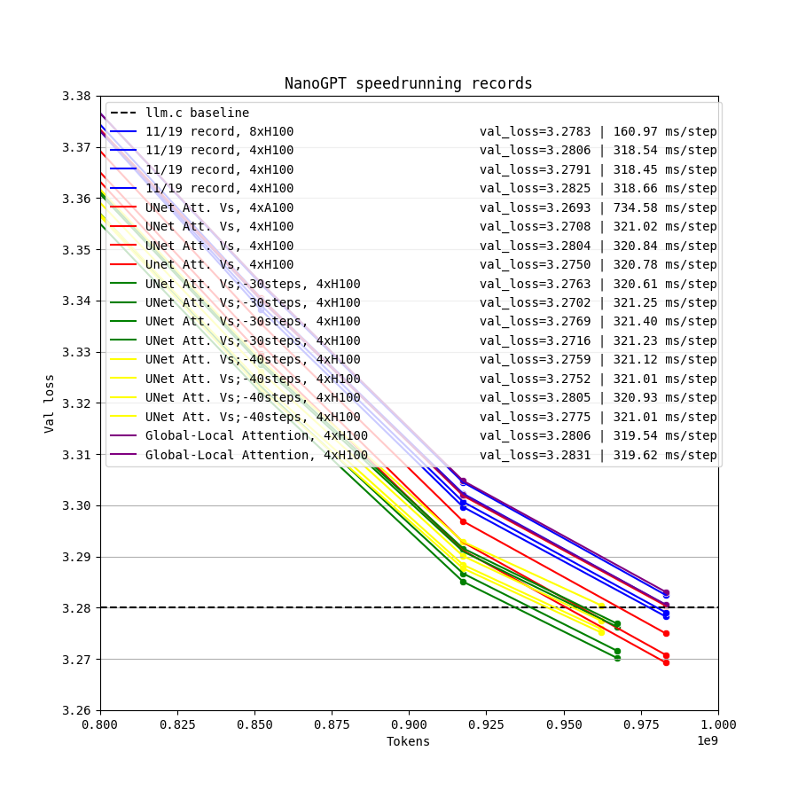
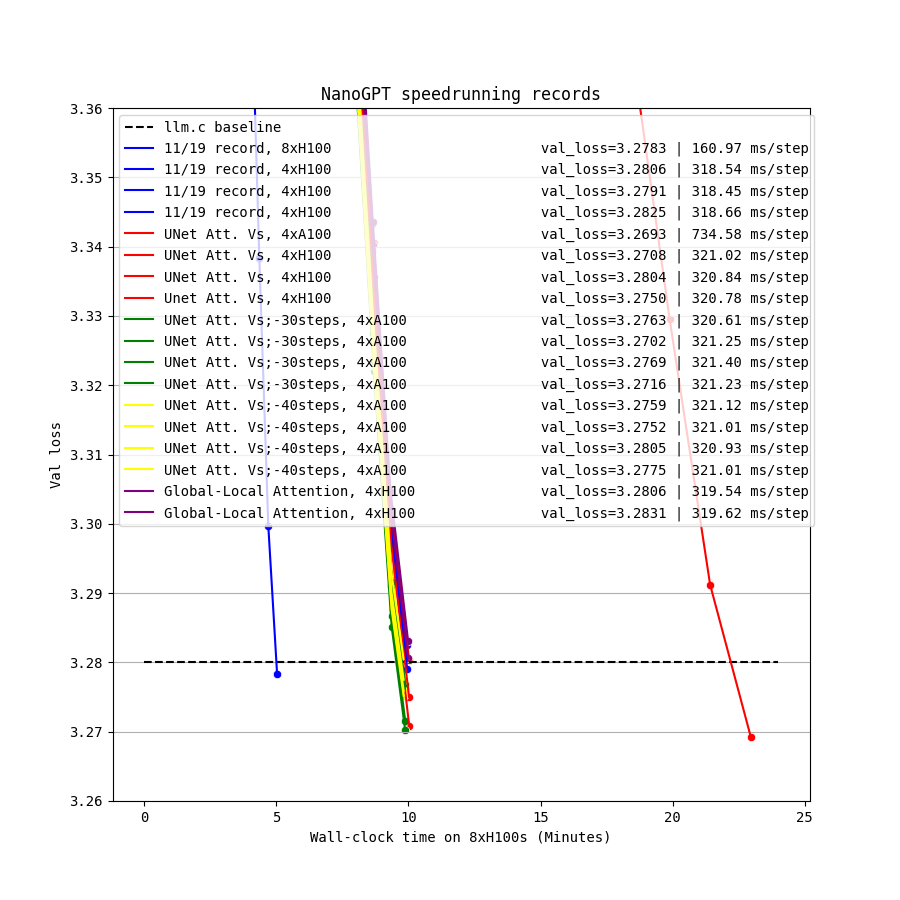

This is a record by Franz Louis Cesista [@leloykun](https://x.com/leloykun).

Changelog:
- Added U-net-like skip connections into the Attention Values

Raw logs:

- 11/19 record, 8xH100
  - [11/19 record, Original](../111924_FlexAttention/8384493d-dba9-4991-b16b-8696953f5e6d.txt)
  - [11/19 record, Replication Attempt #1](c4914481-6b32-4a3a-a449-41e2c595c940.txt)
  - [11/19 record, Replication Attempt #2](a9d67362-5c57-4194-936f-2f2c2795b75f.txt)
- 11/20 record, 4xA100
  - [UNet Attention Values, Attempt #1](44ad04d7-f115-4cb8-a70c-b8b09da600a3.txt)
  - [UNet Attention Values, Attempt #2](63bd09f5-1c19-4f79-b0eb-31bdffabed2e.txt)
  - [UNet Attention Values, Attempt #3](0737e5d1-5bf3-476a-98f4-c3f7a08fde0a.txt)
  - [UNet Attention Values, Attempt #3](1da8bcf8-3280-46c3-b6d0-6811da564e33.txt)
- Tests: Global-Local Attention
  - [Global-Local Attention, Attempt #1](c9c10091-c5ac-4f64-af30-a21e815f675b.txt)
  - [Global-Local Attention, Attempt #2](72d09161-8ce1-4584-8af9-b04f0351b280.txt)

With help from @brendanh0gan for additional tests
